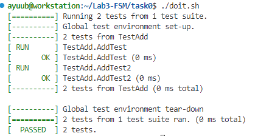
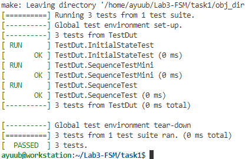
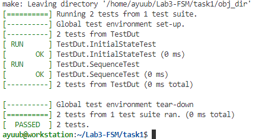
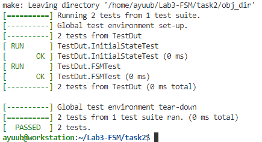
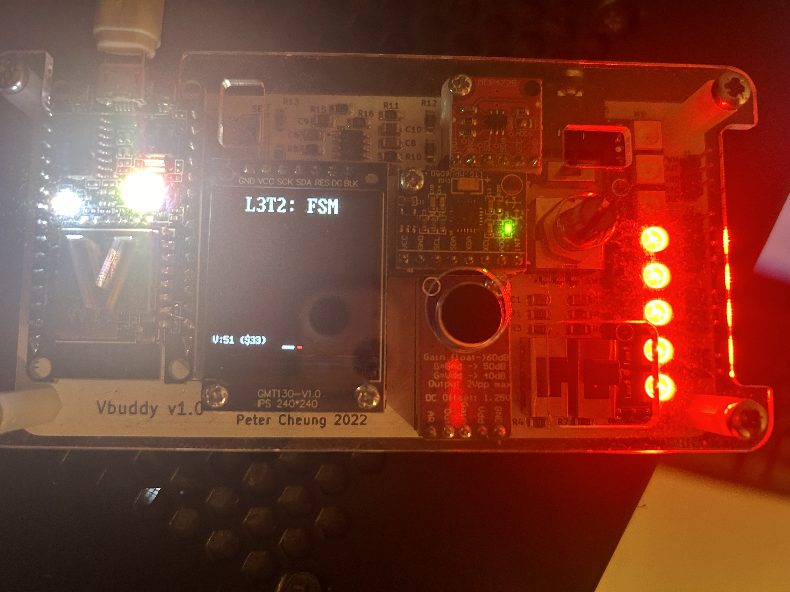

# IAC Logbook: Lab 3

## Table of contents
- [Task 0](#task-0)
- [Task 1](#task-1)
- [Task 2](#task-2)
- [Task 3](#task-3)

### Task 0
The goal of the Lab is to introduce us to verification via simulation with GTest to allow easy simulation of different stimuli. 
For example, below is an example of the result of the test provided in Task 0



The test was a simple check of addition, but this allows us to see how we can integrate GTest with our verilator simulation.

### Task 1
The first part of task 1 is to make a 4-bit LFSR as shown from the diagram below:


and the following code replicates this LFSR:

```Verilog
module lfsr (
    input   logic       clk,
    input   logic       rst,
    input   logic       en,
    output  logic [3:0] data_out
);
    initial data_out = 4'b0001;
    always_ff @(posedge clk or posedge rst) begin
        if (rst) begin
            data_out <= 4'b0001;
        end else if (en) begin
            data_out[0] <= data_out[3]^data_out[2];
            data_out[1] <= data_out[0];
            data_out[2] <= data_out[1];
            data_out[3] <= data_out[2];
        end
    end
endmodule
```
Making sure that the reset is asynchronous by including it inside our always_ff's sensitivity list.

The verification of this module is performed with the testbench given to us and hence shows this LFSR works.


Next up is the 7-bit LFSR represented with the below equation:


This is very similar to the 4-bit LFSR, except the equation now dictates that instead of bit 4 and 3 being XOR'ed, its bit 7 and bit 3.

```Verilog
module lfsr_7 (
    input   logic       clk,
    input   logic       rst,
    input   logic       en,
    output  logic [6:0] data_out
);
    initial data_out = 7'b0000001;
    always_ff @(posedge clk or posedge rst) begin
        if (rst) begin
            data_out <= 7'b0000001;
        end else if (en) begin
            data_out[0] <= data_out[2]^data_out[6];
            data_out[1] <= data_out[0];
            data_out[2] <= data_out[1];
            data_out[3] <= data_out[2];
            data_out[4] <= data_out[3];
            data_out[5] <= data_out[4];
            data_out[6] <= data_out[5];
        end
    end
endmodule
```

And as shown below it also passes the testbench given:


### Task 2
In task 2, we are told to make an FSM following the below diagram:


The outputs change when state does, hence on each en == 1 state and output change.

```Verilog
module f1_fsm (
    input   logic       rst,
    input   logic       en,
    input   logic       clk,
    output  logic [7:0] data_out
);
    typedef enum {S0, S1, S2, S3, S4, S5, S6, S7, S8} state_t;
    state_t myState;

    always_ff @(posedge clk) begin
        if (rst) begin
            myState <= S0;
            data_out <= 8'd0;
        end else begin
            case (myState)
                S0: begin
                    myState <= en ? S1 : S0;
                    data_out <= en ? 8'h01 : 8'h00;
                end
                S1: begin
                    myState <= en ? S2 : S1;
                    data_out <= en ? 8'h03 : 8'h01;
                end
                S2: begin
                    myState <= en ? S3 : S2;
                    data_out <= en ? 8'h07 : 8'h03;
                end
                S3: begin
                    myState <= en ? S4 : S3;
                    data_out <= en ? 8'h0F : 8'h07;
                end
                S4: begin
                    myState <= en ? S5 : S4;
                    data_out <= en ? 8'h1F : 8'h0F;
                end
                S5: begin
                    myState <= en ? S6 : S5;
                    data_out <= en ? 8'h3F : 8'h1F;
                end
                S6: begin
                    myState <= en ? S7 : S6;
                    data_out <= en ? 8'h7F : 8'h3F;
                end
                S7: begin
                    myState <= en ? S8 : S7;
                    data_out <= en ? 8'hFF : 8'h7F;
                end
                S8: begin
                    myState <= en ? S0 : S8;
                    data_out <= en ? 8'h00 : 8'hFF;
                end
            endcase
        end
    end
endmodule
```

Verification was also successful:


Next up came testing the fsm with the Vbuddy based off the code from Lab 2:
```C++
#include "verilated.h"
#include "verilated_vcd_c.h"
#include "Vf1_fsm.h"

#include "vbuddy.cpp"     // include vbuddy code
#define MAX_SIM_CYC 1000000

int main(int argc, char **argv, char **env) {
  int simcyc;     // simulation clock count
  int tick;       // each clk cycle has two ticks for two edges

  Verilated::commandArgs(argc, argv);
  // init top verilog instance
  Vf1_fsm* top = new Vf1_fsm;
  // init trace dump
  Verilated::traceEverOn(true);
  VerilatedVcdC* tfp = new VerilatedVcdC;
  top->trace (tfp, 99);
  tfp->open ("f1_fsm.vcd");
 
  // init Vbuddy
  if (vbdOpen()!=1) return(-1);
  vbdHeader("L3T2: FSM");
  vbdSetMode(1);        // Flag mode set to one-shot

  // initialize simulation inputs
  top->clk = 1;
  top->rst = 0;

  // run simulation for MAX_SIM_CYC clock cycles
  for (simcyc=0; simcyc<MAX_SIM_CYC; simcyc++) {
    // dump variables into VCD file and toggle clock
    
    for (tick=0; tick<2; tick++) {
      tfp->dump (2*simcyc+tick);
      top->clk = !top->clk;
      top->eval ();
    }
    top->rst = (simcyc < 2); // assert reset for 1st cycle
    vbdBar(top->data_out & 0xFF);
    top->en = vbdFlag();
    // either simulation finished, or 'q' is pressed
    if ((Verilated::gotFinish()) || (vbdGetkey()=='q')) 
      exit(0);                // ... exit if finish OR 'q' pressed
  }

  vbdClose();     // ++++
  tfp->close(); 
  exit(0);
}
```

With visual proof that the fsm works:


### Task 3
Next up came studying the clktick module.

The clktick module works by raising tick every N+1 cycles, which is achieved by using a count-down timer, which counts from N to 0, and when count==0, it raises tick and resets the counter, hence providing a tick every N+1 cycles.

N is about 51 on my PC.

I then combined this with the FSM to produce clkfsm.sv, making a design where every ~1s, it raises en, changing fsm state of the fsm from task 2.